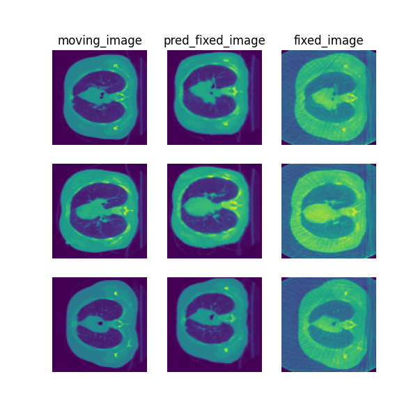
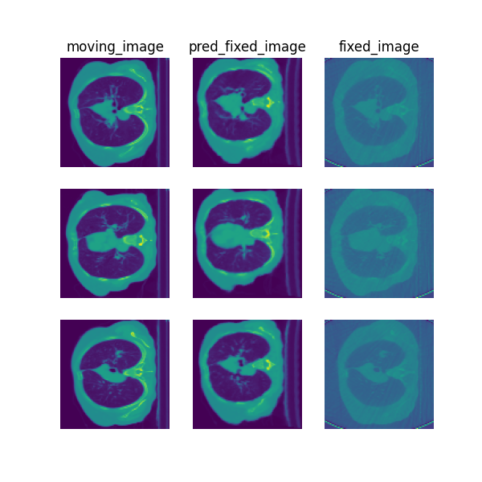
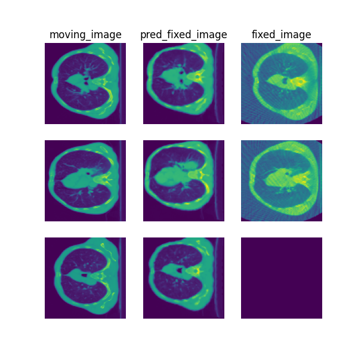

<!-- -->

<!-- 
# docker build . -t deepreg -f Dockerfile
# docker run --name DeepReg --privileged=true --gpus all -ti deepreg bash


# cd C:\Users\Pogorevc\OneDrive - Univerza v Ljubljani\Magisterij\2. Letnik\AMS_izziv\DeepReg
# cd C:\Users\Pogorevc\OneDrive - Univerza v Ljubljani\Magisterij\2. Letnik\AMS_izziv\Validation\deformable-registration\deformable-registration

# docker build . -t evaluation -f Dockerfile

docker run --rm -it -v "C:\Users\Pogorevc\OneDrive - Univerza v Ljubljani\Magisterij\2. Letnik\AMS_izziv\Validation\deformable-registration\deformable-registration\input:/input" -v "C:\Users\Pogorevc\OneDrive - Univerza v Ljubljani\Magisterij\2. Letnik\AMS_izziv\Validation\deformable-registration\deformable-registration\output:/output/" -v ./data:/workspace/data evaluation python evaluation.py -v


# docker start -i DeepReg1


# pip install pydot
# apt-get update && apt-get install -y graphviz
# pip uninstall tensorflow-gpu tensorflow
# pip install tensorflow-gpu==2.10.0
# python AMS/ams_data.py

#python AMS/ams_data.py
#python AMS/ams_data2.py
#python AMS/ams_train.py --full
#python AMS/ams_predict.py --full

#deepreg_vis -m 2 -i 'AMS/ams/logs_predict/20241216-190428/test/pair_0/moving_image.nii.gz, AMS/ams/logs_predict/20241216-190428/test/pair_0/pred_fixed_image.nii.gz, AMS/ams/logs_predict/20241216-190428/test/pair_0/fixed_image.nii.gz' --slice-inds '64,50,72' -s AMS/ams/logs_predict/

#deepreg_vis -m 1 -i 'AMS/ams/logs_predict/20241216-190428/test/pair_0/moving_image.nii.gz --ddf-path "AMS/ams/logs_predict/20241216-190428/test/pair_0/ddf.nii.gz" --slice-inds '2,3' -s AMS/ams/logs_predict/


-->


# AMS IZZIV - final report
## Rok Pogorevc

### **Disclaimer** 
This is a student project
---
<p align="center">
  
</p>

# DeepReg
Original code and documentation available at: https://github.com/DeepRegNet/DeepReg

## Method Explanation
The object was to perform deformable image registration on Thorax CBCT images, aligning moving images to fixed images. The results are evaluated using displacement fields (DDF) with specific metrics, including TRE, DSC, and HD95.
---
## Registration Method
The model uses DDF as the registration method. The primary steps are:

### Network Architecture:

### **Backbone:** 

### UNet with three levels of depth.
Initial Channels: 32, controlling the network size.

Loss Functions:
Image Loss: Sum of Squared Differences (SSD) with a weight of 10.0.

Label Loss: Dice similarity loss at multiple scales.

Regularization: Bending energy to ensure smooth deformation fields with a weight of 2.5.

### Preprocessing:
Data augmentation is applied using affine transformations to make the model robust.
The batch size is set to 4 with shuffling enabled.

### Optimization:
The Adam optimizer is used with a learning rate of 1e-5.
Training:

The model is trained for 8000 epochs, saving the weights every 1000 epochs.

## Setting Up Docker for the Project
Below are instructions to set up and use Docker for the chalange. 
---

### **1. Install Docker**
If Docker is not already installed on your system

### **2. Build the Docker Image**
Use the following command to build the Docker image using the provided `Dockerfile`:

```bash
docker build . -t deepreg -f Dockerfile
```
### **3. Run the Docker Container**

```bash
docker build . -t deepreg -f Dockerfile
```
### **4. Install Additional Dependencies Inside the Container**

Once inside the container, execute the following commands to update and install the necessary dependencies:

1. Update the package list and install Graphviz
```bash
apt-get update && apt-get install -y graphviz
```
2. Uninstall existing TensorFlow versions
```bash
pip uninstall tensorflow-gpu tensorflow
```
3. Install the required version of TensorFlow
```bash
pip install tensorflow-gpu==2.10.0
```

--- 
## Data Preparation
To prepare the data for training, follow the steps below. This section outlines the necessary preprocessing steps and data splitting.

### Step 1: Run the `ams_data.py` Script
Execute the `ams_data.py` script to preprocess and organize the data for training, validation, and testing:

```bash
python ams_data.py
```
1. Downloading the Data:
The script downloads the ThoraxCBCT dataset if it's not already present.

2. Unzipping and Organizing:
Extracts the dataset and organizes it into specific folders: train, valid, and test.

3. Data Splitting:
Splits the data into training, validation, and test sets based on predefined rules or ratios.
Ensures validation data includes specific cases like 0011, 0012, and 0013.

4. Preprocessing:
Normalizes the images to ensure consistent intensity ranges.
Rescales image dimensions as needed for compatibility with the model (e.g., resizing images to match the expected DDF shape).

---
## Output Structure
After running the script, the directory structure will look like this:
```bash
data/
├── train/
│   ├── fixed_images/
│   ├── fixed_labels/
│   ├── moving_images/
│   ├── moving_labels/
├── valid/
│   ├── fixed_images/
│   ├── fixed_labels/
│   ├── moving_images/
│   ├── moving_labels/
├── test/
│   ├── fixed_images/
│   ├── fixed_labels/
│   ├── moving_images/
│   ├── moving_labels/
```
---
## Train Commands
To train the model for this project, use the following command:

```bash
python ams_train.py --full
```
---
## Test Commands
To test the model, use the following command:

```bash
python ams_predict.py --full
```

---

### Results and visualization

The following visualizations illustrate the comparison between the moving image, the predicted fixed image, and the fixed image across different test cases. Each column represents:

1. Moving Image - The original image that needs to be registered.
2. Predicted Fixed Image - The output image after applying the deformation field.
3. Fixed Image - The target image for the registration task

The evaluation was performed on the AMS Challenge dataset 







```bash
case_results [0] [0011_0001<--0011_0000']:
        LogJacDetStd        : 0.02350
        num_foldings        : 0.00000
        TRE_kp              : 16.95331
        TRE_lm              : 19.65747
        DSC                 : 0.15308
        HD95                : 36.51497
case_results [1] [0012_0001<--0012_0000']:
        LogJacDetStd        : 0.02554
        num_foldings        : 0.00000
        TRE_kp              : 13.85208
        TRE_lm              : 14.40804
        DSC                 : 0.28575
        HD95                : 35.12166
case_results [2] [0013_0001<--0013_0000']:
        LogJacDetStd        : 0.02317
        num_foldings        : 0.00000
        TRE_kp              : 21.06048
        TRE_lm              : 23.39744
        DSC                 : 0.10483
        HD95                : 70.89763
case_results [3] [0011_0002<--0011_0000']:
        LogJacDetStd        : 0.02354
        num_foldings        : 0.00000
        TRE_kp              : 16.61175
        TRE_lm              : 14.99693
        DSC                 : 0.15450
        HD95                : 54.61209
case_results [4] [0012_0002<--0012_0000']:
        LogJacDetStd        : 0.02538
        num_foldings        : 0.00000
        TRE_kp              : 22.65494
        TRE_lm              : 25.91111
        DSC                 : 0.10708
        HD95                : 40.49948
case_results [5] [0013_0002<--0013_0000']:
        LogJacDetStd        : 0.02302
        num_foldings        : 0.00000
        TRE_kp              : 15.45530
        TRE_lm              : 17.91634
        DSC                 : 0.20790
        HD95                : 67.24160

 aggregated_results:
        LogJacDetStd        : 0.02403 +- 0.00103 | 30%: 0.02446
        TRE_kp              : 17.76464 +- 3.09317 | 30%: 19.00689
        TRE_lm              : 19.38122 +- 4.18223 | 30%: 21.52746
        DSC                 : 0.16886 +- 0.06266 | 30%: 0.13008
        HD95                : 50.81457 +- 14.40339 | 30%: 38.50722

```
